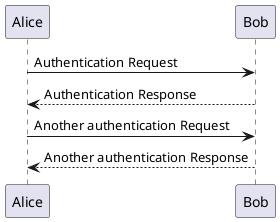

plantuml

     

---

#### a tool for uml in pure text

- [url](https://plantuml.com/en/)
- [guide](https://plantuml.com/en/guide)
- vscode plug: PlantUML
- [inline into markdown](https://blog.anoff.io/2018-07-31-diagrams-with-plantuml/) code type: plantuml

#### pre install
- some graph need install [graphviz](https://graphviz.org/download/)

#### gitbook plugin
> https://github.com/vowstar/gitbook-plugin-uml

#### demo

